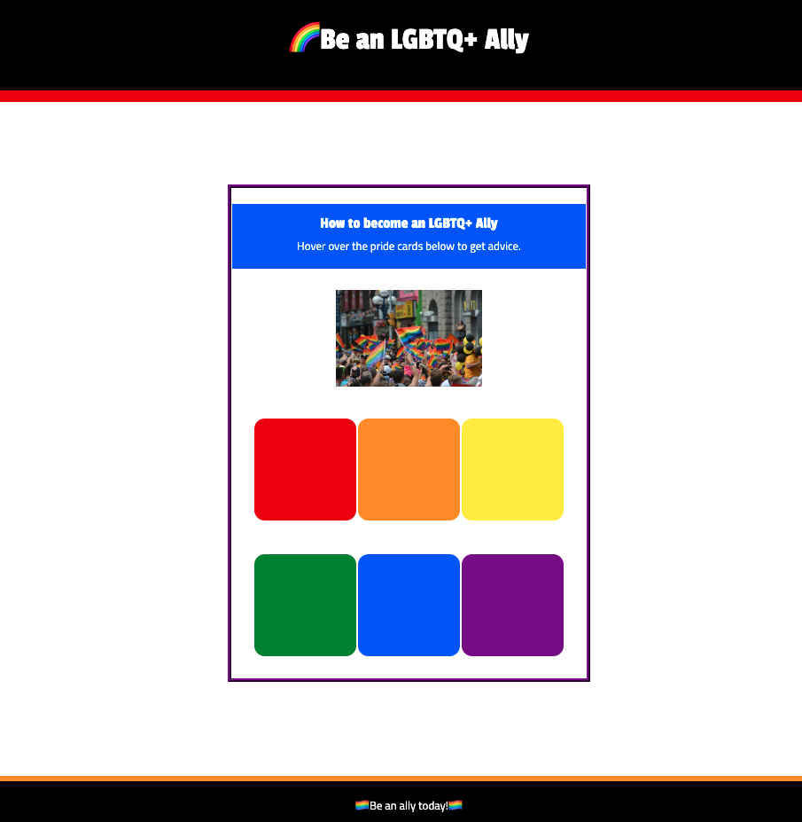
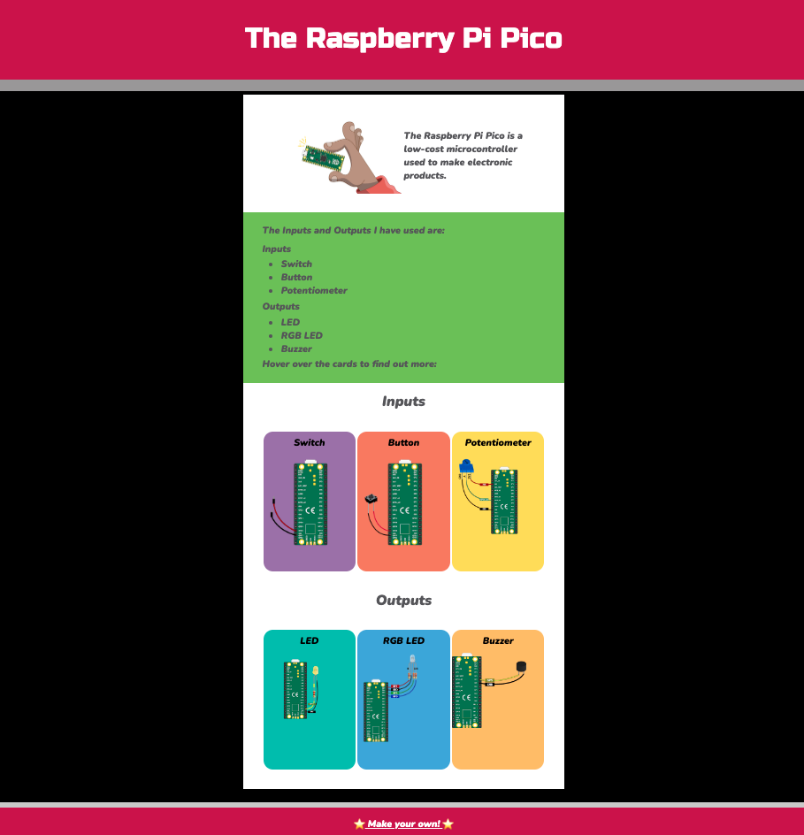

## Introduction

In this project you will use the skills you have developed in the introduction to web path to create a web page about something you want to share. 

The world wide web** or web is a vast collection of connected web pages. The web allows people to view content from all over the world and create their own web pages to share with others. Can you imagine what life was like before the web?

You will:
+ Build a web page to share information with others
+ Create a web page using multiple sections with a variety of HTML elements
+ Use and customise or add CSS classes to style your page

--- no-print ---

--- task ---

### Try it

Can you identify the HTML elements that are used in this project? How has CSS been used to style and animate the page?

**Favourite things**: [See inside](https://trinket.io/html/9f404436b6){:target="_blank"}

<iframe src="https://trinket.io/embed/html/9f404436b6?outputOnly=true" width="600" height="500" frameborder="0" marginwidth="0" marginheight="0" allowfullscreen></iframe>

--- /task ---

--- /no-print ---

### PROJECT BRIEF: Project title

Create a web page about a topic that you find interesting and want to share with others. It could be helpful information for pet owners, a page of your favourite jokes, a walkthrough for a game you enjoy, some advice you have found helpful, a list of useful web sites, or whatever you want to share with web page visitors.

Your web page should:
+ Have multiple sections containing different kinds of content including text and images or emoji, headings, quotations, lists or links
+ Use a colour palette, fonts and CSS styles of your choice
+ Be accessible by using good colour contrast and font sizes

You web page could:
+ Use custom CSS classes that you create and apply
+ Use animations or flip cards to create interest
+ Be shared to the Raspberry Pi Foundation community gallery to inspire others 

--- no-print ---

### Get inspiration

--- task ---

As you look at these web pages, consider what makes them useful and informative as well as fun and accessible:

**Be an LGBTQ+ Ally**: [See inside](https://rpifoundation.trinket.io/sites/be-an-lgbtq-ally){:target="_blank"}

  <iframe allowtransparency="true" width="600" height="600" src="https://rpifoundation.trinket.io/sites/be-an-lgbtq-ally" frameborder="0"></iframe>

**Introduction to Raspberry Pi Pico**: [See inside](https://rpifoundation.trinket.io/sites/raspberry-pi-pico){:target="_blank"}

  <iframe allowtransparency="true" width="600" height="600" src="https://rpifoundation.trinket.io/sites/raspberry-pi-pico" frameborder="0"></iframe>

**Triple filter test**: [See inside](https://rpifoundation.trinket.io/sites/triple-filter-test){:target="_blank"}
Click on the character and object to choose the ones you want in the story, then click on the Stage to turn the page.

  <iframe allowtransparency="true" width="600" height="600" src="https://rpifoundation.trinket.io/sites/triple-filter-test" frameborder="0"></iframe>

--- /task ---

--- /no-print ---

--- print-only ---

--- /print-only ---

