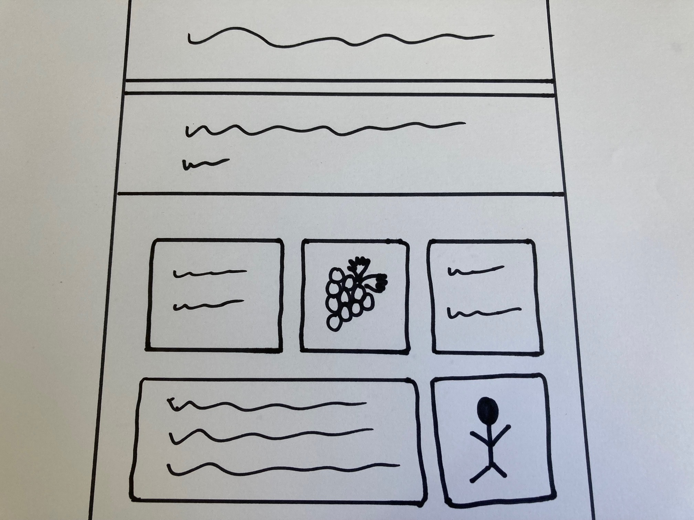

## Your web page topic
In this step you will decide what your web page is about. 

### What do you want to share?

--- task ---

Think about the purpose of your web page.

It could be:

+ ℹ️ An information page about a topic you are interested in
+ 🔗 A collection of links to the best web pages on a topic
+ 😜 Your favourite (polite!) jokes
+ 🎮 A game walk through or other tutorial
+ 🐙 Information about a pet or animal
+ 💬 Some advice that you have found helpful
+ 🏞️ Tourist information about a place you have visited or would like to visit
+ 👩🏿‍🦼 Information about a medical condition or disability that you think more people should be aware of. 

**Tip:** Try to choose a topic that you already know something about. This is so you can spend your time building your web page, not researching a topic.

--- /task ---

### Who is it for?

--- task ---

Who are you making your web page for? It's useful to think about the kind of visitors you are making your page for. 

+ How old will your visitors be? 
+ How much will they know about your topic? 
+ Is the page for other experts in your topic or is is for beginners? 

**Tip:** If you're making a page about a topic you know lots about, make sure you explain it clearly to other people.

--- /task ---

### Get started

--- task ---

If you have paper and a pen or pencil you could sketch out your web page layout. 

You could also make a bullet point list of information that you want to include. 

--- /task ---

--- task ---

Open the [Build a web page starter project](https://trinket.io/library/trinkets/a61473a691){:target="_blank"}. Trinket will open in another browser tab.

--- /task ---
