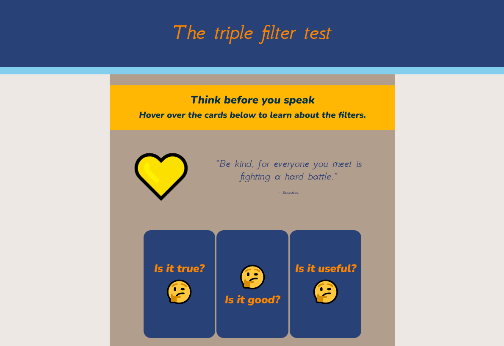

## Build and test

Now it's time to build your web page. 

{:width="300px"}

**Tip:** Plan your project so you will be able to create a basic web page in the time you have available and then upgrade the project if you have time left. 

**Tip:** Remember to test your project each time you add something. It is much easier to find and fix bugs before you make more changes.

--- task ---

You have built up some really useful skills. Here is a reminder to help you make your web page: 

### Colour palette

[[[web-colour-palette-variables]]]

Use or personalise starter project colour palettes:

[[[hex-colour-palettes]]]

[[[web-colour-palette]]]

Create a colour palette from an image:

[[[trinket-image-library]]]

[[[colours-from-image]]]

Customise colour palettes for style and accessibility:

[[[contrast-checker]]]

[[[add-colour-variables]]]

Use your colour palettes to set text and background colours:

[[[web-primary-secondary]]]

### Structure

[[[overall-page-structure]]]

[[[full-width-section]]]

[[[side-by-side-section]]]

[[[wrapped-regular-width]]]

[[[three-text-tiles]]]

[[[web-large-text-tiles]]]

[[[text-image-text]]]

[[[wrapped-wide-narrow]]]

[[[web-wrap-gap]]]

[[[full-width-quote]]]

[[[using-rem]]]

[[[web-x-y-centering]]]

### Fonts and text elements

Choose fonts to use on your web page:

[[[included-fonts]]]

[[[web-fonts]]]

[[[google-fonts]]]

You can use placeholder text while you work on your layout:

[[[add-placeholder-text]]]

Insert text elements:

[[[web-ordered-list]]]

[[[web-unordered-list]]]

[[[web-create-link]]]

[[[full-width-quote]]]

Style your text:

[[[web-headers-large-text]]]

[[[web-center-text]]]

[[[web-strong-em]]]

### Images

Insert an image from the starter project library:

[[[trinket-image-library]]]

[[[web-alt-text]]]

Use an emoji as an image:

[[[choose-an-emoji]]]

[[[huge-emoji]]]

Add a background image:

[[[web-background-image]]]

[[[add-transparency]]]

**Tip:** You can style your images with rounded corners or borders:

[[[rounded-corners]]]

[[[web-borders]]]

[[[web-box-shadow]]]

### Animations

Create web flip cards:

[[[web-flip-cards]]]

Use animations to change the appearance or position of elements on your page over time:

[[[web-starter-animations]]]

[[[web-customise-animations]]]

### More style

Add more style to any elements on your web page:

[[[rounded-corners]]]

[[[web-borders]]]

[[[add-a-gradient]]]

[[[web-animate-span]]]

You can create your own class to make a new style:

[[[web-add-class]]]

--- /task ---

--- task ---

**Test:** Show someone else your project and get their feedback. Do you want make any changes to your web page? 

If you have a Trinket account, you can click on the Remix button to save a copy to your My Trinkets library.

If you don’t have a Trinket account, you can still come back to your project in the future on the same computer by using the starter project link.

You can also publish your saved project to see what it would look like as a full web page. Each time you save your project your published site will update:

[[[trinket-publish-project]]]

Tip: To make your web page viewable by people with disabilities and appealing to a wide audience you need to make sure it is accessible:

[[[check-accessibility]]]

--- /task ---

--- task ---

**Debug:** You might find some bugs in your HTML or CSS that you need to fix. Here are some common bugs.

**My webpage isn't displaying correctly**

[[[incorrect-tags]]]

[[[mismatched-tags]]]

**Further debug questions**

[[[image-not-displayed]]]

[[[font-not-displayed]]]

[[[web-debug-link]]]

You might find a bug not listed here. Can you figure out how to fix it?

We love hearing about your bugs and how you fixed them. Use the feedback button at the bottom of this page if you found a different bug in your project.

--- /task ---

