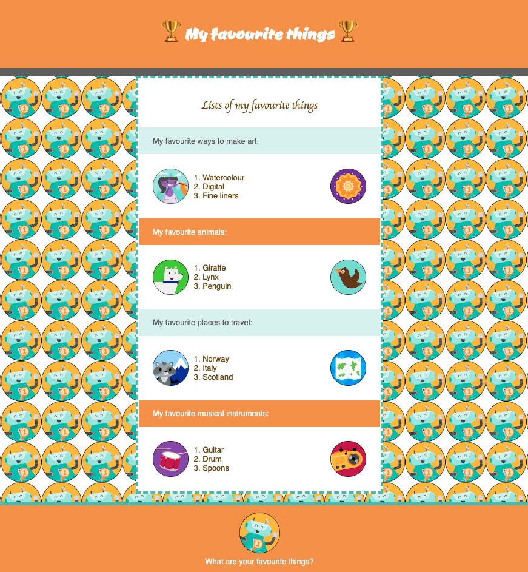

## Introduction

Dans ce projet, tu utiliseras les compétences que tu as développées dans le parcours [Intro au web](https://projects.raspberrypi.org/fr-FR/pathways/web-intro) pour créer une page web sur quelque chose que tu souhaites partager.

Le World Wide Web ou web est une vaste collection de pages web connectées. Le web permet aux gens de consulter des contenus provenant du monde entier et de créer leurs propres pages web à partager avec d'autres. Peux-tu imaginer ce qu'était la vie avant le web ?

Tu vas :

- Créer une page web pour partager des informations avec d'autres personnes
- Créer une page web en utilisant plusieurs sections avec une variété d'éléments HTML
- Utiliser et personnaliser ou ajouter des classes CSS pour styliser ta page

--- no-print ---

--- task ---

### Essaie-le

Peux-tu identifier les éléments HTML utilisés dans ce projet ? Comment CSS a-t-il été utilisé pour styliser et animer la page ?

**Choses préférées** : [voir à l'intérieur](https://editor.raspberrypi.org/fr-FR/projects/favourite-things){:target="_blank"}

<iframe src="https://editor.raspberrypi.org/fr-FR/embed/viewer/favourite-things" width="600" height="500" frameborder="0" marginwidth="0" marginheight="0" allowfullscreen> </iframe>

--- /task ---

--- /no-print ---

### DESCRIPTION DU PROJET : créer une page web

Crée une page web sur un sujet que tu trouves intéressant et que tu souhaites partager avec d’autres. Il peut s'agir d'informations utiles pour les propriétaires d'animaux de compagnie, d'une page de tes blagues préférées, d'une procédure pas à pas pour un jeu que tu aimes, de conseils que tu as trouvés utiles, d'une liste de sites web utiles ou de tout ce que tu souhaites partager avec les visiteurs de ta page web.

Ta page web devrait :

- Avoir plusieurs sections contenant différents types de contenu, notamment du texte et des images, des emojis, des titres, des citations, des listes ou des liens
- Utiliser une palette de couleurs, des polices et des styles CSS qui fonctionnent bien ensemble
- Être accessible en utilisant un bon contraste de couleurs et de bonnes tailles de police

Ta page web pourrait :

- Utiliser des classes CSS personnalisées que tu crées et appliques
- Utiliser des animations ou retourner des cartes pour susciter l'intérêt
- Être partagé à la galerie communautaire de la Raspberry Pi Foundation pour inspirer les autres

--- no-print ---

### Trouve l'inspiration

--- task ---

En consultant ces pages web, réfléchis à ce qui les rend utiles et informatives, mais aussi amusantes et accessibles :

⭐ Partage ton projet terminé pour avoir une chance qu'il soit présenté ici.

**⭐ Introduction au Raspberry Pi Pico** : [voir à l'intérieur](https://editor.raspberrypi.org/fr-FR/projects/raspberry-pi-pico){:target="_blank"}

<iframe src="https://editor.raspberrypi.org/fr-FR/embed/viewer/raspberry-pi-pico" width="600" height="500" frameborder="0" marginwidth="0" marginheight="0" allowfullscreen> </iframe>

**⭐ Critique de livre** : [voir à l'intérieur](https://editor.raspberrypi.org/fr-FR/projects/book-review){:target="_blank"}

<iframe src="https://editor.raspberrypi.org/fr-FR/embed/viewer/book-review" width="600" height="500" frameborder="0" marginwidth="0" marginheight="0" allowfullscreen> </iframe>

**⭐ Égypte** : [voir à l'intérieur](https://editor.raspberrypi.org/fr-FR/projects/egypt){:target="_blank"}

<iframe src="https://editor.raspberrypi.org/fr-FR/embed/viewer/egypt" width="600" height="500" frameborder="0" marginwidth="0" marginheight="0" allowfullscreen> </iframe>

**⭐ Fashion Pi** : [voir à l'intérieur](https://editor.raspberrypi.org/fr-FR/projects/fashion-pi){:target="_blank"}

<iframe src="https://editor.raspberrypi.org/fr-FR/embed/viewer/fashion-pi" width="600" height="500" frameborder="0" marginwidth="0" marginheight="0" allowfullscreen> </iframe>

--- /task ---

--- /no-print ---

--- print-only ---

--- /print-only ---
