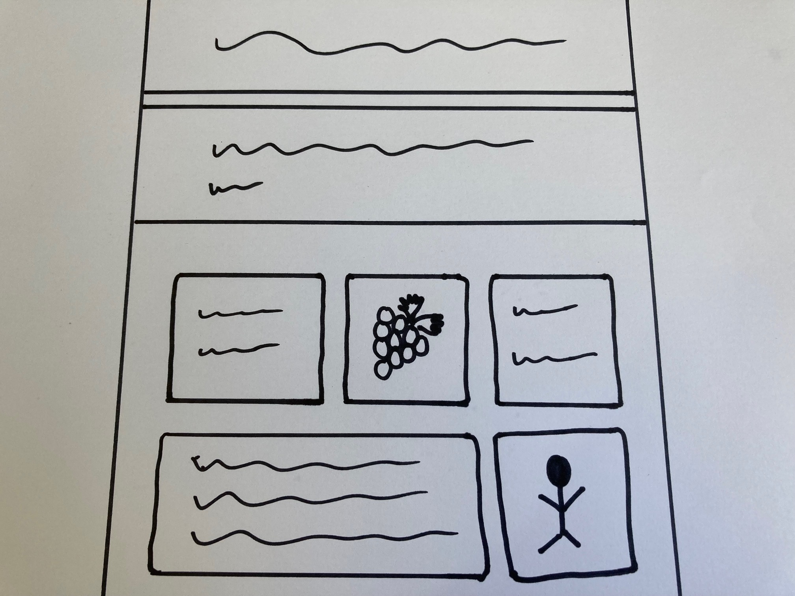

## Ton sujet

Dans cette étape, tu décideras du sujet de ta page web.

{:width="300px"}

### Que veux-tu partager ?

\--- task ---

Pense à l’objectif de ta page web.

Ça pourrait être :

- ℹ️ Une page d'information sur un sujet qui t'intéresse
- 🔗 Une collection de liens vers les meilleures pages web sur un sujet
- 🧧 Des informations sur une fête ou un événement de ta culture
- 😜 Ta blague favorite (polie !)
- 🎮 Une procédure pas à pas du jeu ou un autre tutoriel
- 🐙 Des informations sur un animal de compagnie ou un animal
- 💬 Quelques conseils que tu as trouvés utiles
- 🏞️ Des informations touristiques sur un lieu que tu as visité ou que tu aimerais visiter
- 👩🏿‍🦼 Des informations sur un problème de santé ou un handicap dont tu penses que davantage de personnes devraient être conscientes

**Astuce :** essaie de choisir un sujet que tu connais déjà. Cela te permet de consacrer ton temps à la création de ta page web, et non à la recherche d'un sujet.

\--- /task ---

### À qui s'adresse-t-il ?

\--- task ---

Pour qui crées-tu ta page web ? Il peut être utile de réfléchir aux types de visiteurs pour lesquels tu souhaites créer ta page.

- Quel sera l'âge de tes visiteurs ?
- Que sauront-ils de ton sujet ?
- La page est-elle destinée aux autres experts dans ton domaine ou aux débutants ?

**Astuce :** si tu fais une page sur un sujet que tu connais bien, assure-toi de l'expliquer clairement à d'autres personnes.

\--- /task ---

### Commencer

\--- task ---

Si tu as du papier et un stylo ou un crayon, tu peux dessiner la mise en page de ta page web.

Tu peux également créer une liste à puces des informations que tu souhaites inclure.

\--- /task ---

\--- task ---

Ouvre le [projet de démarrage Créer une page web](https://editor.raspberrypi.org/fr-FR/projects/build-a-web-page-starter){:target="_blank"}. Le Code Editor s'ouvrira dans un autre onglet du navigateur.

\--- /task ---

\--- task ---

Remplace le texte de l'élément `<title>` par le titre de ta page.

[[[web-add-title-head]]]

\--- /task ---

