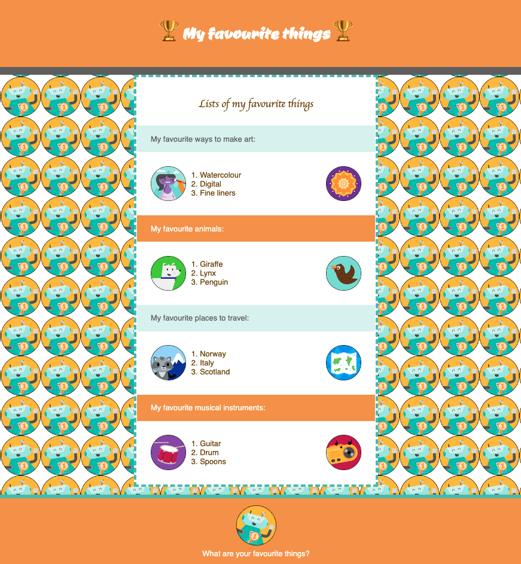
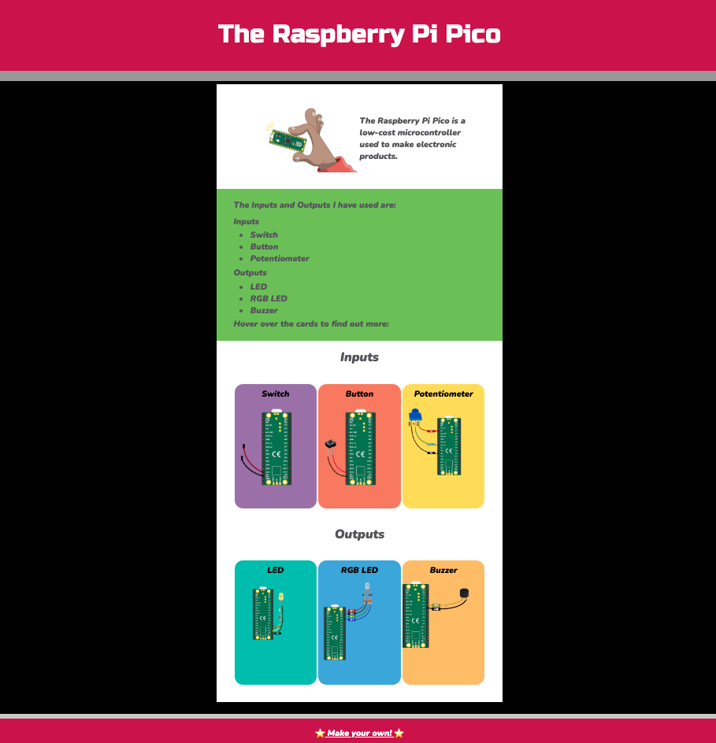

## Inleiding

In dit project ga je de vaardigheden die je hebt ontwikkeld in het pad [Inleiding tot web](https://projects.raspberrypi.org/en/pathways/web-intro) gebruiken om een webpagina te maken over iets dat je wilt delen.

Het World Wide Web of web is een grote verzameling van met elkaar verbonden webpagina's. Dankzij het web kunnen mensen content van over de hele wereld bekijken en hun eigen webpagina's maken die ze met anderen kunnen delen. Kun je je voorstellen hoe het leven was vóór het internet?

Je gaat:

- Een webpagina bouwen om informatie met anderen te delen
- Een webpagina maken met meerdere secties met verschillende HTML-elementen
- CSS-klassen gebruiken en aanpassen of toevoegen om jouw pagina te stylen

\--- no-print ---

\--- task ---

### Probeer het uit

Kun je de HTML-elementen identificeren die in dit project worden gebruikt? Hoe is CSS gebruikt om de pagina te stylen en te animeren?

**Favoriete dingen**: [Bekijk van binnen](https://editor.raspberrypi.org/en/projects/favourite-things){:target="_blank"}

<iframe src="https://editor.raspberrypi.org/en/embed/viewer/favourite-things" width="600" height="500" frameborder="0" marginwidth="0" marginheight="0" allowfullscreen> </iframe>

\--- /task ---

\--- /no-print ---

### PROJECT SAMENVATTING: Bouw een webpagina

Maak een webpagina over een onderwerp dat je interessant vindt en met anderen wilt delen. Het zou nuttige informatie kunnen zijn voor huisdiereigenaren, een pagina met je favoriete grapjes, een stap voor stap uitleg voor een spel wat je graag speelt, een aantal handige adviezen, een lijst met nuttige websites of wat je ook maar wilt delen met bezoekers van de webpagina.

Je webpagina zou:

- Meerdere secties met verschillende soorten inhoud, zoals tekst en afbeeldingen, emoji's, koppen, citaten, lijsten of links moeten hebben
- Een kleurenpalet, lettertypen en CSS-stijlen moeten gebruiken die goed samengaan
- Toegankelijk moeten zijn door te zorgen voor goede kleurcontrasten en lettergroottes

Je webpagina zou:

- Aangepaste CSS klassen kunnen gebruiken die je zelft maakt en toepast
- Animaties of flipcards kunnen gebruiken om interesse te wekken
- Kunnen worden gedeeld met de Raspberry Pi Foundation galerij om anderen te inspireren

\--- no-print ---

### Doe inspiratie op

\--- task ---

Terwijl je naar deze webpagina's kijkt, bedenk dan wat ze nuttig en informatief maakt, maar ook leuk en toegankelijk:

⭐ Deel je voltooide project en maak kans dat het hier wordt getoond.

**⭐ Inleiding tot Raspberry Pi Pico**: [Bekijk van binnen](https://editor.raspberrypi.org/en/projects/raspberry-pi-pico){:target="_blank"}

<iframe src="https://editor.raspberrypi.org/en/embed/viewer/raspberry-pi-pico" width="600" height="500" frameborder="0" marginwidth="0" marginheight="0" allowfullscreen> </iframe>

**⭐ Boekrecensie**: [Bekijk van binnen](https://editor.raspberrypi.org/en/projects/book-review){:target="_blank"}

<iframe src="https://editor.raspberrypi.org/en/embed/viewer/book-review" width="600" height="500" frameborder="0" marginwidth="0" marginheight="0" allowfullscreen> </iframe>

**⭐ Egypte**: [Bekijk van binnen](https://editor.raspberrypi.org/en/projects/egypt){:target="_blank"}

<iframe src="https://editor.raspberrypi.org/en/embed/viewer/egypt" width="600" height="500" frameborder="0" marginwidth="0" marginheight="0" allowfullscreen> </iframe>

**⭐ Fashion Pi**: [Bekijk van binnen](https://editor.raspberrypi.org/en/projects/fashion-pi){:target="_blank"}

<iframe src="https://editor.raspberrypi.org/en/embed/viewer/fashion-pi" width="600" height="500" frameborder="0" marginwidth="0" marginheight="0" allowfullscreen> </iframe>

\--- /task ---

\--- /no-print ---

\--- print-only ---

\--- /print-only ---
